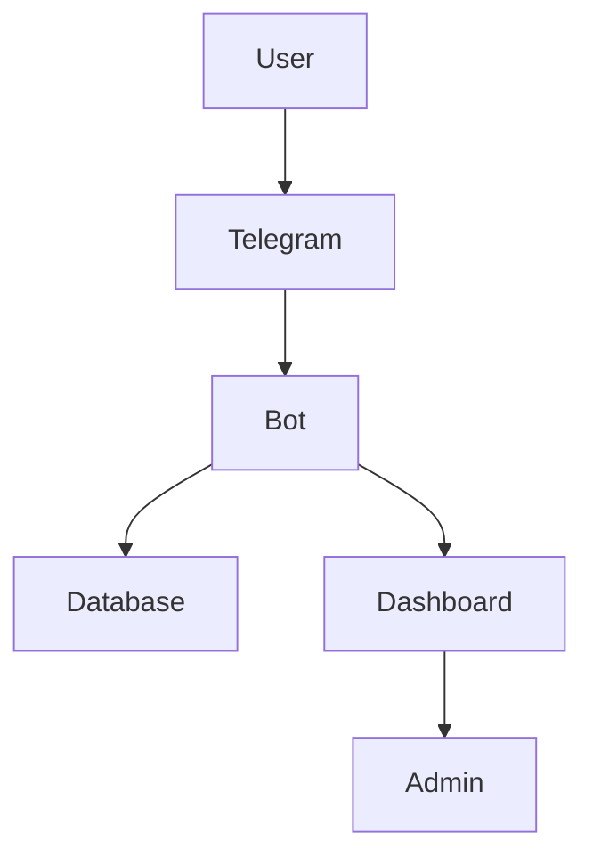
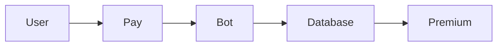

# ☁️ CloudHelp Manager

https://img.shields.io/badge/status-active-success  
https://img.shields.io/badge/Python-3.12-blue?logo=python  
https://img.shields.io/badge/Aiogram-v3-green  
https://img.shields.io/badge/license-MIT-blue  

CloudHelp Manager adalah **Telegram Bot berbasis SaaS** yang menyediakan sistem lengkap untuk:
- 🛡️ Moderasi grup otomatis
- 📊 Analytics real-time
- 💳 Sistem pembayaran & subscription
- 🎫 Support ticket system
- 💎 Premium & Group License

---

# 🏢 About Company

CloudHelp Manager merupakan bagian dari produk perusahaan:

## 🚀 **K-Cloud JSN**

K-Cloud JSN adalah platform yang berfokus pada:
- ☁️ Cloud-based automation
- 🤖 Bot & SaaS solutions
- 💰 Monetization systems
- 📊 Business analytics tools

Tujuan utama K-Cloud JSN adalah membangun solusi digital yang:
- Scalabel ✅
- Otomatis ✅
- Siap digunakan untuk bisnis ✅

---

# 🎯 Features

## 🛡️ Moderation & Security
- Anti Spam / Flood / Link / Raid
- Auto Mute / Ban / Delete
- Filter kata & regex

## 👥 Member System
- Welcome message
- Verification (captcha button)
- XP & ranking system

## 🎫 Support System
- Ticket creation
- Forward ke admin group
- Admin reply → user

## 💎 Premium System
- Subscription active / expire
- Auto renew
- Premium user tracking

## 💰 Payment System
- Telegram Stars
- Manual (IDR / USD)
- Revenue tracking

## 🧾 License System
- License per grup
- Expire otomatis
- Auto disable bot

## 📊 Analytics
- Dashboard statistik
- Tracking user & grup
- Growth monitoring

---

# 🧠 System Architecture



---

# ⚙️ Project Structure

```
cloudhelp_manager/
├── app/              # Main bot
├── core/             # Plugin loader
├── modules/          # All feature modules
├── database/         # Database logic
├── dashboard/        # Web dashboard
├── middlewares/      # Security & roles
├── services/         # Business logic
├── utils/            # Helpers
├── requirements.txt
└── bot.py
```

---

# 🚀 Getting Started

## 1️⃣ Clone Repository

```bash
git clone https://github.com/yourusername/your-repo.git
cd your-repo
```

---

## 2️⃣ Create Virtual Environment

```bash
python3 -m venv venv
source venv/bin/activate
```

---

## 3️⃣ Install Dependencies

```bash
pip install -r requirements.txt
```

---

## 4️⃣ Setup Environment

Buat file `.env`

```
BOT_TOKEN=your_token_here
```

---

## 5️⃣ Run Bot

```bash
python -m app.bot
```

✅ Bot akan aktif di Telegram

---

# 🌐 Deployment

## 🚀 Railway (Recommended)

1. Push repo ke GitHub
2. Connect ke Railway
3. Tambahkan ENV:
   ```
   BOT_TOKEN=your_token
   ```
4. Deploy

---

# 💳 Payment Flow



---

# 📊 Dashboard Features

- 📈 Analytics real-time
- 💰 Revenue monitoring
- 👥 Statistik user

---

# 🔐 Security

- ENV token (aman ✅)
- Role-based access ✅
- Logging system ✅

---

# 🧩 Roadmap

- [ ] QRIS Auto Payment
- [ ] Crypto Payment
- [ ] AI Moderation
- [ ] Advanced Dashboard UI
- [ ] Multi-language

---

# 🤝 Contributing

Pull request sangat terbuka 🚀  
Silakan fork & develop!

---

# 📄 License

MIT License

---

# 💬 Contact

Project under **K-Cloud JSN**  
Telegram: @kairajsn
