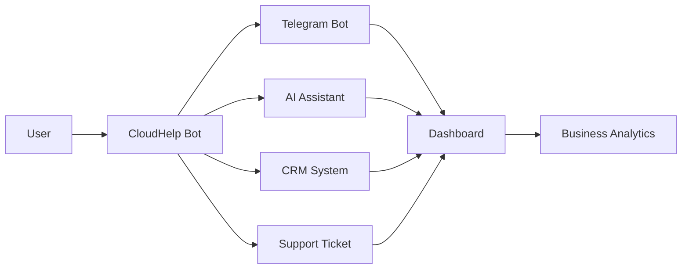
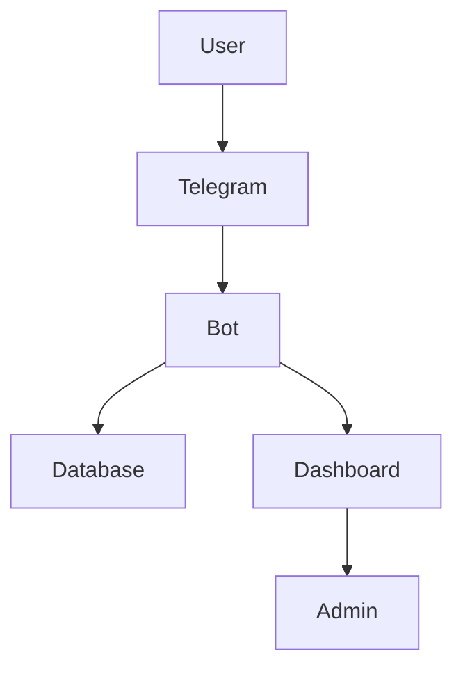
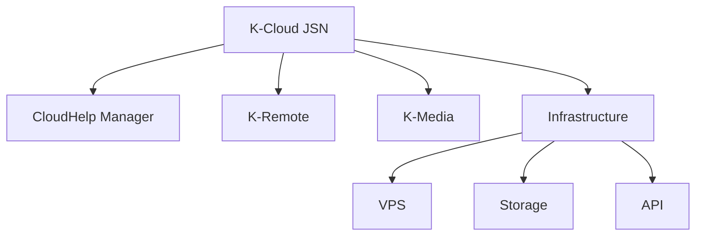

<div align="center">


[](https://git.io/typing-svg)

<br>


</div>

---

# 🤖 CloudHelp Manager

CloudHelp Manager adalah **Telegram Bot berbasis SaaS** yang berfungsi sebagai:

- 🛡️ Moderation System  
- 🎫 Customer Support Platform  
- 💳 Payment & Subscription System  
- 📊 Analytics Dashboard  
- 💎 Premium & Group Licensing  

Dirancang untuk membantu bisnis, komunitas, dan startup dalam mengelola komunikasi secara otomatis dan efisien.

---

# 🏢 Part of K-Cloud JSN

CloudHelp Manager merupakan bagian dari ekosistem:

## ☁️ **K-Cloud JSN**

K-Cloud JSN adalah ecosystem teknologi yang berfokus pada:

- ☁️ Cloud Platforms  
- 🤖 AI Automation  
- 📊 Business Tools  
- 🚀 Digital Innovation  

---

# 🌐 CloudHelp Platform Flow



---

# 🧠 System Architecture



---

# 🎯 Key Features

## 🛡️ Moderation System
- Anti Spam / Flood / Link / Raid  
- Auto Mute / Ban / Delete  
- Word filtering system  

## 🎫 Support System
- Ticket creation system  
- Admin reply system  
- User communication  

## 💎 Subscription System
- Premium user system  
- Expiration tracking  
- Auto renew  

## 🧾 License System
- Group-based license  
- Auto expire  
- Auto disable bot  

## 💰 Payment System
- Telegram Stars  
- Manual Payment (IDR / USD)  
- Revenue tracking  

## 📊 Analytics
- User activity tracking  
- Growth statistics  
- Dashboard reporting  

---

# ⚙️ Project Structure

```
cloudhelp_manager/
├── app/              # Main bot system
├── core/             # Plugin loader
├── modules/          # Bot features
├── database/         # Data handling
├── dashboard/        # Web dashboard
├── middlewares/      # Security layer
├── services/         # Business logic
├── utils/            # Helpers
├── bot.py
├── requirements.txt
```

---

# 🚀 Getting Started

## Clone Repository

```bash
git clone https://github.com/yourusername/your-repo.git
cd your-repo
```

---

## Setup Environment

```bash
python3 -m venv venv
source venv/bin/activate
```

---

## Install Dependencies

```bash
pip install -r requirements.txt
```

---

## Setup Token

Tambahkan di Railway / ENV:

```
BOT_TOKEN=your_token
```

---

## Run Bot

```bash
python -m app.bot
```

✅ Bot akan aktif

---

# 🌐 Deployment (Railway)

1. Push ke GitHub  
2. Connect ke Railway  
3. Tambahkan ENV:
```
BOT_TOKEN=your_token
```
4. Deploy  

---

# 📊 Ecosystem Connection



---

# 🛠 Technology Stack

<div align="center">

</div>

---

# 🚀 Roadmap

- 🟢 Core Bot System ✅  
- 🟡 Dashboard Development  
- 🔵 AI Integration  
- 🟣 Multi-platform automation  

---

# 🤝 Collaboration

Kami terbuka untuk:

- Developers  
- AI Engineers  
- Startup Builders  
- Digital Creators  

---

# 📄 License

MIT License

---

<div align="center">


### ☁️ CloudHelp Manager  
### Powered by K-Cloud JSN  

🚀 Build • Automate • Scale

</div>
